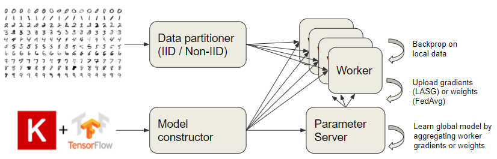

# federated-learning

## Presentation slides & problem set
Presentation slides: [https://docs.google.com/presentation/d/12jUREcnDRW5Y1KSwwKtV8Z1VbaPSPOCtcdpUC38d3nY/edit?usp=sharing](https://docs.google.com/presentation/d/12jUREcnDRW5Y1KSwwKtV8Z1VbaPSPOCtcdpUC38d3nY/edit?usp=sharing)

Problem set (jupyter): [problem_set.ipynb](problem_set.ipynb)

Problem set (pdf): [problem_set.pdf](problem_set.pdf)

## Overview
A Keras implementation of [FederatedAvergaing](http://proceedings.mlr.press/v54/mcmahan17a/mcmahan17a.pdf) [McMahan, Brendan, et al. 2017] and [Lazily Aggregated Stochastic Gradients](https://arxiv.org/pdf/2002.11360.pdf) [Chen, Tianyi, Yuejiao Sun, and Wotao Yin. 2020]

This repository implements a simulated environment for comparing the performance of federated learning algorithms.

Currently supported:
- Vanilla SGD
- FederatedAveraging
- LASG (using LASG-WK2 condition)



## Dependencies
Tensorflow 2.3 or greater


## Directions
1. Set desired hyperparameters for Vanilla SGD, FederatedAveraging, and LASG-WK2 within mnist.py or nietzsche.py
2. Execute the script
```shell
python mnist.py
```
or
```shell
python nietzsche.py
```
3. When the experiments complete, results will be saved to the current working directory.
